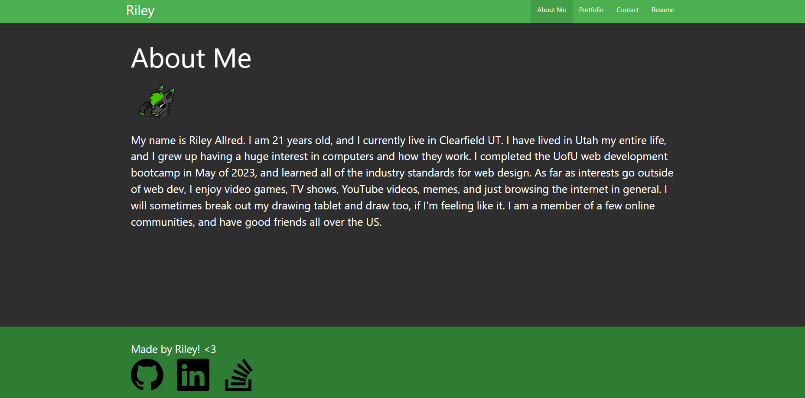

# Riley's Portfolio

## Description

My work portfolio that has my projects, a contact form, a list of my skills with my resume, and an about me section where you can read about me.

## Installation

This application uses React. Node is required to use and install. After downloaded, use npm i to install dependencies, then run npm start to launch a dev server.

## Usage

You can view the published webpage [here](https://spawze.github.io/Riley-Portfolio-V2/)  

The home page is my 'about me' section. There are tabs on the top that let you navigate to different sections of the webpage.

## Credits

Made from scratch by Riley using React and other packages.

## License

MIT License

Please See License file in the repository.
